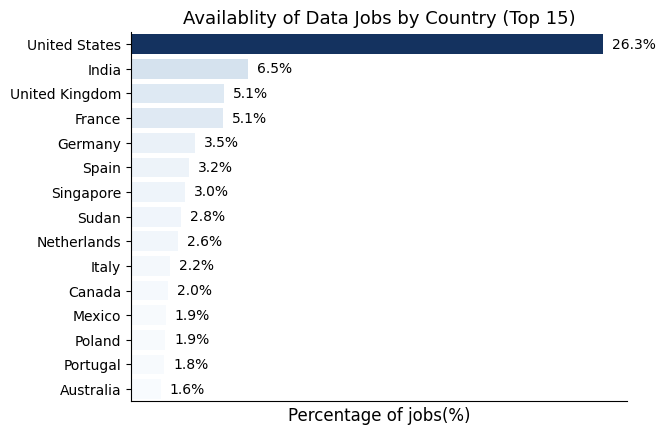

# Data Jobs Market Analysis Using Hugging Face Dataset

## Introduction
This project presents an end-to-end exploratory data analysis of the global data jobs market using a dataset sourced from Hugging Face. The objective is to understand job distribution across countries, roles, experience levels, skills, and salary trends through systematic data cleaning, visualization, and interpretation. The analysis focuses on converting raw job data into actionable insights that reflect real-world hiring patterns in the data domain.

---

## Dataset
The dataset is obtained from Hugging Face and consists of structured job posting data related to data roles. It includes attributes such as job title, country, experience level, required skills, and salary information. The dataset was loaded using the Hugging Face `datasets` library and converted into a Pandas DataFrame for analysis.

---

## Data Cleaning
Data preprocessing involved removing duplicate entries, handling missing values in salary and skill fields, standardizing categorical values such as country and job titles, and converting salary columns into consistent numerical formats. Records with insufficient or inconsistent information were filtered out to ensure reliability of the analysis.

---

## Data Visualization and Analysis

### Country-wise Distribution of Data Jobs

The chart shows that the United States accounts for the largest share of data job postings at approximately 26%, followed by India at around 6% and the United Kingdom at roughly 5%. Although India ranks second, the gap between the US and India is substantial, with the US offering more than four times the number of opportunities. This indicates a strong concentration of data roles in mature markets, while emerging markets like India, despite high talent availability, have comparatively fewer job postings in this dataset.

---

### Job Role Distribution

This visualization indicates that Data Analyst roles dominate the dataset, followed by Data Scientist and Data Engineer positions. The higher proportion of analyst roles suggests that organizations prioritize business intelligence, reporting, and decision support functions over advanced modeling or infrastructure roles. This reflects a demand-driven focus on extracting insights from data rather than solely building complex systems.

---

### Experience Level Distribution

The chart highlights that entry-level and mid-level roles form the majority of job postings, while senior and executive positions are significantly fewer. This distribution suggests that companies are expanding operational data teams rather than focusing only on leadership hiring. It also indicates strong opportunities for early-career professionals entering the data field.

---

### Salary Distribution by Job Role

The salary distribution shows that Data Scientists and Data Engineers have higher median salaries compared to Data Analysts, along with a wider spread. This reflects the premium placed on advanced technical expertise such as machine learning, system design, and large-scale data processing. The variation in salary also suggests strong dependence on factors like experience, location, and organizational scale.

---

### Skill Demand Frequency

This chart shows that Python and SQL are the most frequently required skills across job postings, followed by tools such as Excel and data visualization libraries. The dominance of these skills indicates that core data manipulation and querying capabilities remain fundamental across all data roles, regardless of specialization.

---

### Skill vs Salary Relationship

The visualization demonstrates that roles requiring specialized skills such as machine learning frameworks, cloud platforms, and big data tools tend to offer higher median salaries. This highlights a clear skill-premium effect, where advanced and less common technical skills directly contribute to higher compensation.

---

### Optimal Skill Combinations

This chart illustrates that combinations of foundational skills (Python, SQL) with specialized technologies result in better salary outcomes compared to standalone skills. It suggests that professionals who blend strong fundamentals with targeted specialization are better positioned in the job market.

---

### Skill Popularity vs Market Value

The chart indicates that some highly popular skills do not necessarily correspond to the highest salaries, while certain niche skills, despite lower demand, command higher pay. This reflects a supply-demand imbalance where scarcity of expertise increases market value.

---

## Final Insights
The analysis reveals that the global data job market is heavily concentrated in developed economies, with the United States leading by a significant margin despite growing participation from countries like India. Entry and mid-level roles dominate hiring, indicating expansion of data teams across industries. Foundational skills such as Python and SQL are universally required, while advanced and specialized skills strongly influence salary potential. Overall, the dataset highlights that combining strong fundamentals with selective specialization provides the most effective strategy for career growth in the data domain.

---

## Tech Stack
- Python
- Pandas, NumPy
- Matplotlib, Seaborn
- Hugging Face Datasets

---

## Conclusion
This project demonstrates a complete data analysis workflow, starting from raw data ingestion using Hugging Face datasets to structured cleaning, visualization, and insight generation. By analyzing geographic distribution, role demand, experience levels, skill requirements, and salary trends, the project highlights how data-driven approaches can uncover meaningful patterns in real-world job markets. The findings emphasize the importance of strong foundational skills combined with targeted specialization for long-term career growth in the data domain.

---

## Future Scope
- Incorporate time-series analysis to study hiring trends over multiple years  
- Apply machine learning models to predict salary ranges based on skills and experience  
- Extend the analysis to compare remote vs on-site job opportunities  
- Automate data ingestion to keep the analysis updated with new datasets  

---

## References
- Hugging Face Datasets  
- Public data job market sources  

---

## Author
**Pritika Mediboina**  
Data Analytics | Python | SQL | Data Visualization

